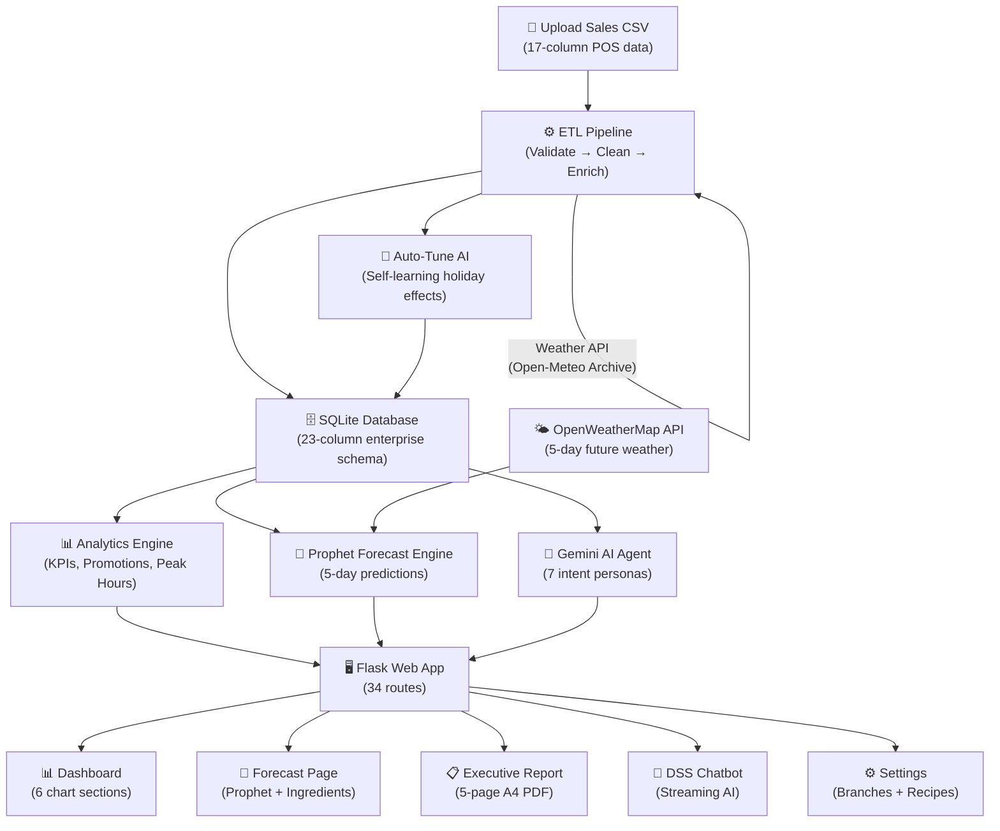
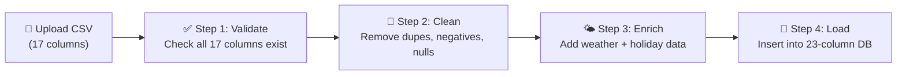
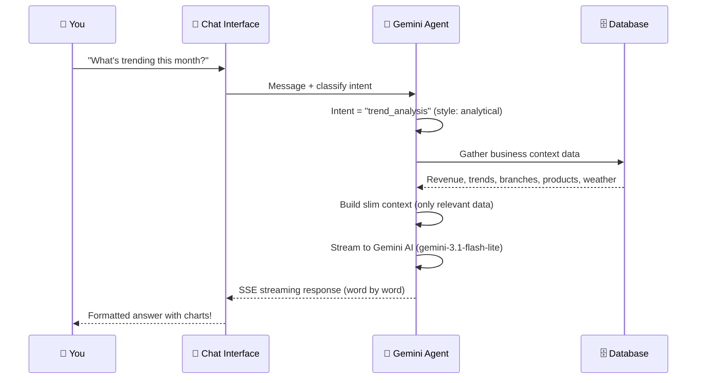
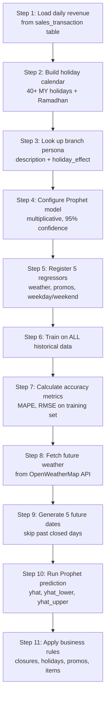
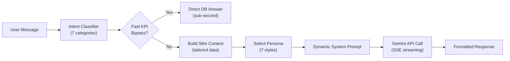
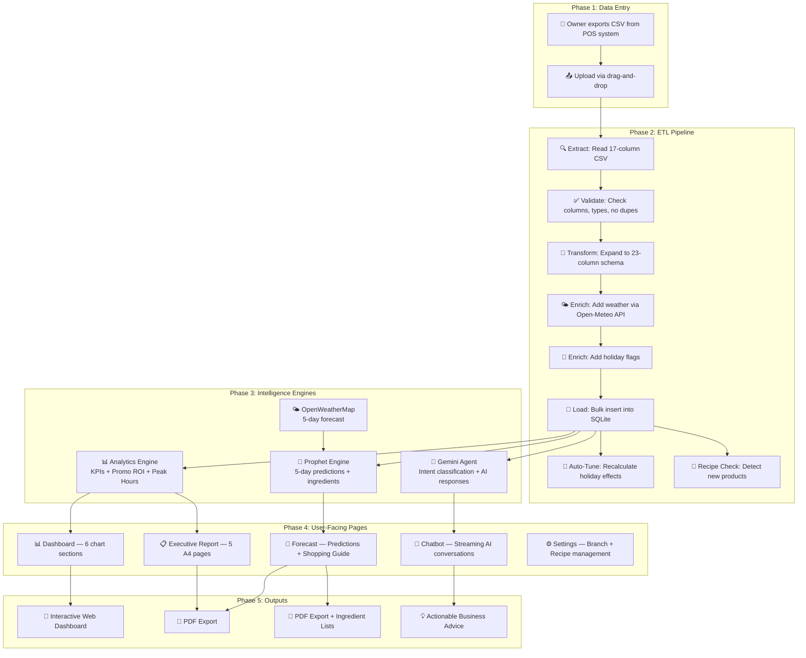

# ☕ MCS Analytics — AI Forecasting System
## Complete User Manual & System Walkthrough

> **Prepared for:** Business Owner / Stakeholder Demo  
> **System:** Mini Coffee Shop Analytics — AI Forecasting Platform  
> **Powered by:** Facebook Prophet + Google Gemini AI  
> **Version:** Production  
> **Date:** June 2026

---

## 📋 Table of Contents

1. [What Is This System?](#-what-is-this-system)
2. [System Architecture — How Everything Connects](#-system-architecture--how-everything-connects)
3. [Page-by-Page Walkthrough](#-page-by-page-walkthrough)
   - [Page 1: Login](#page-1--login)
   - [Page 2: Dashboard (Sales Overview)](#page-2--dashboard-sales-overview)
   - [Page 3: Data Ingestion (Upload)](#page-3--data-ingestion-upload)
   - [Page 4: AI Forecast](#page-4--ai-forecast)
   - [Page 5: Executive Report (PDF)](#page-5--executive-report-pdf)
   - [Page 6: DSS Chatbot (AI Advisor)](#page-6--dss-chatbot-ai-advisor)
   - [Page 7: Manage Business (Settings)](#page-7--manage-business-settings)
4. [All Calculations & Formulas Explained](#-all-calculations--formulas-explained)
5. [The Forecasting Engine — Deep Dive](#-the-forecasting-engine--deep-dive)
6. [The AI Brain — How the Chatbot Thinks](#-the-ai-brain--how-the-chatbot-thinks)
7. [System Flow — End to End](#-system-flow--end-to-end)
8. [Behind the Scenes — File by File](#-behind-the-scenes--file-by-file)
9. [Key Benefits Summary](#-key-benefits-summary)

---

## 🎯 What Is This System?

Imagine having a **personal business analyst + weather forecaster + inventory planner + AI consultant** — all working 24/7 for your coffee business. That's what this system does.

The **MCS Analytics AI Forecasting System** is a web-based business intelligence platform built specifically for Malaysian coffee shop operations (stalls, food trucks, and outlets). It takes your everyday sales data and transforms it into:

- 📊 **Real-time dashboards** — See how your business is performing across all outlets at a glance
- 🔮 **5-day AI sales predictions** — Using Facebook Prophet (the same AI used by Facebook/Meta) to predict future revenue with weather and holiday awareness
- 📋 **Professional A4 executive reports** — Exportable PDF reports with predicted vs actual analysis, promotion ROI, and AI-powered strategic advisories
- 🤖 **An AI business advisor** — Chat in English or Bahasa Malaysia with Google Gemini AI that knows your live business data
- 🛒 **Smart ingredient forecasting** — Automatically calculates how many kg of coffee beans, litres of milk, etc. you need to buy for the next 5 days
- 🌤️ **Weather-aware predictions** — Adjusts forecasts based on actual weather forecasts (rainy days = fewer customers)
- 🕌 **Malaysia-specific intelligence** — Aware of public holidays, Ramadhan patterns, payday windows, and festive closures

> [!TIP]
> This isn't just a dashboard — it's a **Decision Support System (DSS)** that actively tells you what to do, what to buy, and when to prepare extra staff.

---

## 🏗️ System Architecture — How Everything Connects



**In simple terms:**
1. You **upload** your POS (Point of Sale) sales data as a CSV file
2. The system **validates, cleans, and enriches** it (adds weather data and holiday markers)
3. It stores everything in a **23-column enterprise database**
4. Three powerful engines work on your data: **Analytics** (what happened), **Prophet** (what will happen), and **Gemini AI** (what should you do)
5. Results appear on **7 beautiful, interactive pages**

---

## 📱 Page-by-Page Walkthrough

---

### Page 1: 🔐 Login

**URL:** `/login`  
**What you see:** A stunning split-screen login page with animated visual effects.

#### Left Panel — Brand Story
| Element | What It Shows |
|---|---|
| Background image | Coffee-themed hero image with dark overlay |
| Floating orbs | 3 animated gradient circles floating slowly (18-26 second cycles) |
| Brand name | "MCS Analytics — AI Forecasting System" |
| Hero headline | "Predicting the Pulse of Every Cup" (gradient text) |
| Feature pills | "Precision 5-Day Forecasts" and "AI Business Advisor" |
| Stats strip | "85.0% Model Accuracy", "5-Day Horizon", "Local MY Holidays" |

#### Right Panel — Login Form
| Element | Function |
|---|---|
| Username field | Enter your admin username (with user icon) |
| Password field | Enter your password (with lock icon + show/hide toggle) |
| Remember me | Checkbox to stay logged in |
| Sign In button | Submits with loading spinner ("Authenticating...") |

#### How Security Works:
- Username and password are checked against **environment variables** (stored securely in `.env` file)
- On success, the system creates a **Flask session** — like a temporary VIP pass that remembers you're logged in
- All other pages check for this session — if it's missing, you get redirected back here

> [!NOTE]
> This page is **standalone** — it has its own design and doesn't share the sidebar navigation. After logging in, you'll see the full navigation sidebar on all other pages.

---

### Page 2: 📊 Dashboard (Sales Overview)

**URL:** `/dashboard`  
**What you see:** The command center — a comprehensive overview with KPIs, 6 chart sections, and promotion intelligence.

#### Filter Controls (Top)
| Filter | Options | What It Does |
|---|---|---|
| **Period** | All Time, Last 7 Days, specific years, specific months | Controls which time range all data covers |
| **Outlet** | All Outlets, or individual branches | Filter to a specific branch or see all combined |

#### 📊 KPI Summary Cards (4 Cards)

| Card | What It Shows | How It's Calculated |
|---|---|---|
| **Total Sales (RM)** | Total money earned | `SUM(Total_Bill_MYR)` for the selected period |
| **Cups Sold** | Total drink volume | `SUM(transaction_qty)` for the period |
| **Total Orders** | Number of transactions + sparkline chart | `COUNT(*)` + last 7 days mini-chart |
| **Best Outlet Last Month** | Top performing branch | Branch with highest `SUM(Total_Bill_MYR)` in the previous month |

Each card shows:
- An **animated counter** that rolls up to the final number
- A **trend indicator** (↑ green arrow or ↓ red arrow) with percentage change

> **Trend % Formula:**
> ```
> Change = ((This Month Revenue - Last Month Revenue) ÷ Last Month Revenue) × 100
> ```
> Example: Made RM 10,000 this month, RM 8,000 last month → **+25%** ↑ 🟢

#### 📈 Chart Sections (6 Sections)

##### Section 1: Sales Performance
| Chart | Type | What It Shows |
|---|---|---|
| **Sales Over Time** | Line chart (Plotly) | Daily/Monthly revenue trend with average target line |
| **Sales by Product Type** | Donut chart | Revenue split by category (e.g., Hot Drinks 55%, Cold Drinks 30%) |

##### Section 2: Menu Performance
| Chart | Type | What It Shows |
|---|---|---|
| **Best-Selling Drinks** | Ranked progress bars | Top 5 products by quantity sold with visual bars |
| **Drinks That Need a Boost** | Red progress bars | Bottom 3 underperforming products |

##### Section 3: Operations & Timing
| Chart | Type | What It Shows |
|---|---|---|
| **How Customers Pay** | Donut chart | Payment method distribution (Cash, E-Wallet, Card, etc.) |
| **Busiest Hours** | Bar chart with gradient | Hourly sales volume — with a **Regular/Ramadhan toggle** to compare patterns! |

> [!TIP]
> The Ramadhan toggle is special — during the fasting month, customer patterns shift dramatically (peak hours move to evening after breaking fast). This toggle lets you compare regular vs Ramadhan patterns side by side.

##### Section 4: Revenue Retention Analysis
| Chart | Type | What It Shows |
|---|---|---|
| **Gross Sales vs. Retained Cash** | Overlaid bar chart | Compares what you sold (gross) vs what you actually kept (net after discounts), with a retention % line |

##### Section 5: Outlet Quality Analysis
| Chart | Type | What It Shows |
|---|---|---|
| **AOV by Outlet** | Grouped bar chart | Average Order Value per branch — tells you which outlet's customers spend more per visit |

> **AOV = Total Revenue ÷ Number of Transactions**

##### Section 6: Promotion Intelligence
| Column | What It Shows |
|---|---|
| Promo Code | The promotion campaign name |
| Type | Volume (B1F1) or Percentage discount |
| Qty Sold | Units moved under this promo |
| Gross / Discount / Net | Revenue breakdown |
| Discount Ratio | What percentage of gross sales was given away as discount |
| Inventory Risk | HIGH RISK or LOW RISK badge |

> **Discount Ratio = Total Discount ÷ Total Gross Sales**
> - If ratio ≥ 0.45 → "Volume (B1F1)" promo (giving away nearly half!)
> - If ratio > 0 → "Percentage" discount promo
> - If ratio = 0 → "Fixed" price promo

#### API Endpoints Called:
- `/api/dashboard_filters` — Gets available years/months for dropdowns
- `/api/kpis` — KPI card data
- `/api/charts` — All chart data
- `/api/promo-efficiency` — Promotion table data

---

### Page 3: 📤 Data Ingestion (Upload)

**URL:** `/upload`  
**What you see:** A drag-and-drop upload area on the left, warehouse profile on the right, and upload history below.

#### How It Works — The 4-Step ETL Pipeline:



##### Required CSV Format (17 Columns):
Your POS system must export these columns:

| Column | Example | Purpose |
|---|---|---|
| `Transaction_ID` | TXN-001 | Unique sale identifier |
| `Timestamp` | 2026-06-01T10:30:00 | When the sale happened |
| `Register_ID` | REG-01 | Which register/terminal |
| `Cashier_Name` | Ali | Who made the sale |
| `Store_ID` | STB-PJ1 | Which branch (must match registered branch codes) |
| `Item_Name` | Iced Latte | Product name |
| `Item_Category` | Coffee | Product category |
| `Quantity_Sold` | 2 | How many units |
| `Modifiers` | {"size": "Large"} | Customizations (JSON) |
| `Order_Type` | Dine-in | Dine-in, Takeaway, etc. |
| `Gross_Sales` | 24.00 | Total before discounts |
| `Discount_Amount` | 4.00 | Discount given |
| `Promo_Code` | RAMADHAN20 | Promotion used |
| `Discount_Reason` | Seasonal | Why discount was given |
| `Tax_Amount` | 1.20 | SST/tax charged |
| `Net_Sales` | 21.20 | Final amount paid |
| `Payment_Type` | E-Wallet | How customer paid |

##### What Happens Behind the Scenes:

**Step 1 — Validate:**
- Checks all 17 columns exist
- Removes rows where `Quantity_Sold ≤ 0` or `Gross_Sales ≤ 0` or `Net_Sales ≤ 0`
- Catches duplicate `Transaction_ID` values (rejects entire batch if found!)

**Step 2 — Clean & Transform (produces 23 columns):**
The system expands your 17 columns into a richer 23-column enterprise schema:

| New Column | How It's Calculated |
|---|---|
| `transaction_date` | Extracted from Timestamp |
| `transaction_time` | Extracted from Timestamp |
| `Hour` | Hour component (0-23) |
| `Day Name` | Monday, Tuesday, etc. |
| `Month Name` | January, February, etc. |
| `product_id` | Auto-generated: `SKU-{hash of name}` |
| `unit_price_MYR` | **`Gross_Sales ÷ Quantity_Sold`** |

**Step 3 — Enrich with Weather:**
- For each transaction date, the system calls the **Open-Meteo Archive API** to get historical weather
- It only looks at **daylight hours (7 AM - 7 PM)** to determine the dominant weather
- Weather classification logic:

| Condition | Rule |
|---|---|
| **Fair / Sunny** | Daylight precipitation < 2.5mm AND majority of hours have clear sky codes |
| **Cloudy** | Daylight precipitation < 2.5mm AND majority of hours have cloud codes |
| **Raining** | Daylight precipitation ≥ 2.5mm, no thunderstorm codes |
| **Thunderstorm** | Daylight precipitation ≥ 2.5mm AND thunderstorm weather codes detected |

- Also adds `is_public_holiday` flag (0 or 1) by checking against **40+ Malaysian public holidays** (2024-2027)

**Step 4 — Load:**
- Bulk inserts into SQLite database
- **Strict duplicate prevention** — if ANY transaction ID already exists, the entire batch is rejected
- After successful upload, triggers **Auto-Tune AI** (`sync_business_intelligence()`) which recalculates holiday impact multipliers for each branch

##### Recipe Detection:
After upload, the system checks if any new products in the CSV don't have ingredient recipes defined. If found, it alerts you and opens a recipe modal on the Forecast page.

#### Right Panel — Warehouse Profile:
| Stat | What It Shows |
|---|---|
| Total Records | How many sales transactions in the database |
| Categories | Number of unique product categories |
| Date Range | From oldest to newest transaction date |
| Branch Matrix | Per-branch record counts with percentage bars |

#### Upload History Table:
Shows all previously uploaded files with: filename, file size, upload date/time, and status.

---

### Page 4: 🔮 AI Forecast

**URL:** `/forecast`  
**What you see:** The **star of the system** — a comprehensive AI-powered 5-day sales prediction page with ingredient planning.

This is the most complex and feature-rich page in the entire system (2,016 lines of template code!).

#### Control Panel
| Control | What It Does |
|---|---|
| **Branch Selector** | Choose which outlet to forecast |
| **Generate Forecast** | Triggers the AI prediction engine |

#### Loading Animation (5 Steps):
When generating a forecast, you see a beautiful step-by-step animation:
1. ⏳ Loading sales data
2. 📅 Adding public holidays
3. 🤖 Running AI model (Prophet)
4. 🌤️ Checking weather forecasts
5. 📊 Building forecast

#### KPI Cards (After Forecast)

| Card | What It Shows | Formula |
|---|---|---|
| **Forecast Error Rate** | MAPE — how far off predictions typically are | `Average of |actual - predicted| ÷ |actual| × 100` |
| **Average Daily Error** | RMSE in RM — average dollar error | `√(Average of (actual - predicted)²)` |
| **Forecast Accuracy** | Percentage with animated ring | `max(0, (1 - MAPE) × 100)` |
| **Expected 5-Day Revenue** | Total predicted revenue | `SUM of all 5 days' predicted values` |

#### 🛒 Ingredient Shopping Guide

This is incredibly useful — the system tells you **exactly what to buy** for the next 5 days!

| Ingredient | How It's Calculated |
|---|---|
| Coffee Beans (kg) | For each product: `recipe_beans_g × predicted_quantity`, then total ÷ 1000 |
| Fresh Milk (L) | For each product: `recipe_milk_ml × predicted_quantity`, then total ÷ 1000 |
| Cocoa Powder (kg) | For each product: `recipe_choco_g × predicted_quantity`, then total ÷ 1000 |
| Crushed Ice (kg) | For each product: `recipe_ice_g × predicted_quantity`, then total ÷ 1000 |
| Whip Cream (kg) | For each product: `recipe_whip_g × predicted_quantity`, then total ÷ 1000 |
| Hot/Cold Cups | Count of predicted units by cup type |
| Custom ingredients | Dynamically calculated from recipe registry (syrups, toppings, etc.) |

> **The Core Formula:**
> ```
> predicted_qty(item) = (historical_qty_per_RM for that item) × predicted_daily_revenue
> ```
> In plain English: "If historically every RM 1 of revenue meant selling 0.08 Iced Lattes, and tomorrow's predicted revenue is RM 500, then predict 0.08 × 500 = 40 Iced Lattes."

> [!WARNING]
> **Stock Warning** appears as a red card if any ingredient exceeds threshold: coffee beans > 5kg, milk > 30L, or ice > 40kg — signaling you need to plan a big order!

#### Revenue Forecast Chart (Plotly)
- **Solid blue line** (left): Last 30 days of actual sales
- **Dashed amber line** (right): Next 5 days of predictions
- **Shaded band**: Confidence interval (95% — the "best case" and "worst case" range)
- **Vertical divider**: Marks where history ends and prediction begins

#### Forecast vs Actual (FVA) Chart
- **Two views**: "Last 7 Days" or "By Month" (with month dropdown)
- **Amber dashed line**: What the system predicted
- **Teal solid line**: What actually happened
- This lets you verify how accurate the system has been!

#### Hourly + Weather Analysis
| Chart | What It Shows |
|---|---|
| **Best and Slowest Hours** | Bar chart showing revenue by hour, with peak hour highlighted |
| **Weather vs Sales** | Grouped bars: how sales differ by weather (Sunny/Cloudy/Raining) across shifts (Morning/Afternoon/Evening) |

#### 🌤️ Weather Outlook Strip
Horizontal scrollable cards showing the 5-day weather forecast:
- Day name, date, temperature, rain probability
- Shift-by-shift breakdown (Morning, Afternoon, Evening, Night)
- Closed days shown with a locked icon

#### Day-by-Day Forecast Table
| Column | What It Shows |
|---|---|
| Date | The forecasted date |
| Day | Day of week badge (with special Friday/Holiday markers) |
| Weather | Weather icon + temperature + rain % |
| Notes & Promotions | Active promotion badges, holiday markers |
| Predicted RM | Main prediction value |
| Low / High | Confidence interval bounds |

#### What Drives the Forecast Panel
| Driver | What It Shows |
|---|---|
| Weather impact | Sunny/Cloudy average vs Rainy average (with progress bars) |
| Active promotions | Badges for detected promotions |
| Holiday effect | Per-branch holiday impact percentage from AI learning |

#### Recipe Modal
If new products are detected without recipes, a modal pops up allowing you to define:
- Base ingredients: beans (g), milk (ml), choco (g), ice (g), whip cream (g)
- Cup type: Hot or Cold
- Custom ingredients: Dynamic rows with name, unit (ml/g/pcs), and amount

---

### Page 5: 📋 Executive Report (PDF)

**URL:** `/report`  
**What you see:** A professional A4 document preview system that generates 5-page executive reports.

#### Configuration
| Control | Options |
|---|---|
| **Target Branch** | All Operational Outlets, or specific branch |
| **Reporting Month** | Any month with available data |
| **Generate Preview** | Builds the 5-page report on screen |
| **Export PDF** | Downloads as professional PDF document |

#### The 5-Page Report:

##### 📄 Page 1 — Executive Summary & Revenue Trend

| Section | Content |
|---|---|
| Confidentiality strip | "CONFIDENTIAL — INTERNAL USE ONLY" |
| Header | Company name, report period, scope, compilation timestamp |
| KPI grid | Total Gross Revenue, Total Transactions, Daily Avg Revenue, AOV, Peak Hour, Busiest Day |
| Key Findings | Period vs Prior comparison, Top Branch, AOV analysis |
| Revenue Trend | Last 6 months × branches table with highlighted current month |

**Key Formulas on Page 1:**
```
Daily Average = Total Revenue ÷ Calendar Days in Period
AOV (Average Order Value) = Total Revenue ÷ Total Transactions
Period Change % = ((Current Period - Previous Period) ÷ Previous Period) × 100
```

##### 📄 Page 2 — Predicted vs Actual (PVA)

| Section | Content |
|---|---|
| Summary KPIs | Prediction Target, Actual Target, Forecast Precision (X/Y days), MAPE |
| Daily Table | Date, Day, Predicted, Actual, Variance, Variance %, Status badge |

**Status Badges:**
| Badge | Meaning | Rule |
|---|---|---|
| 🟢 On Target | Prediction was very close | Variance % between -5% and +5% |
| 🟡 Safe Range | Prediction was reasonably close | Variance % between -15% and +15% |
| 🔴 Off Range | Prediction was significantly off | Variance % beyond ±15% |
| ⚡ Exceeded | Actual exceeded prediction significantly | Actual was much higher than predicted |
| ⬜ No Data | No actual sales for that day | Closed day or future date |

**PVA Formulas:**
```
Variance = Actual Revenue - Predicted Revenue
Variance % = (Variance ÷ Predicted) × 100
MAPE = Average of |Variance %| across all days with actual data
```

##### 📄 Page 3 — Product Performance & Regional/Category

| Section | Content |
|---|---|
| Top 5 Products | Ranked with revenue, share %, activity bars |
| Bottom 3 Underperformers | Products needing attention |
| Branch Performance | Revenue per outlet with activity bars |
| Category Distribution | Revenue by product category (bar charts) |
| Payment Mix | Transaction count by payment method |

**Product Share % = (Product Revenue ÷ Total Revenue) × 100**

##### 📄 Page 4 — Transaction Flow

| Section | Content |
|---|---|
| Promotion Efficiency | Campaign code, strategy, volume, gross, discounts, net |
| Hourly Volume | 24-hour transaction pattern with peak star marker |
| Day-of-Week Pattern | Which days are busiest |

##### 📄 Page 5 — AI Advisories & Diagnostics

| Section | Content |
|---|---|
| AI Strategic Advisories | 3-sentence executive summary + 3 action steps (AI-generated by Gemini) |
| Operational Velocity Diagnostics | Revenue Variance, Growth Drift %, AOV Shift, Forecast Accuracy |
| Key Findings Summary | Auto-generated findings table |
| Procurement Warning | If ingredients need urgent ordering |

**Diagnostics Formulas (30-Day Rolling Window):**
```
Revenue Variance (RM) = Last 30 Days Revenue - Previous 30 Days Revenue
Revenue Variance (%) = ((Last 30 - Prev 30) ÷ Prev 30) × 100
AOV Shift = AOV_last_30 - AOV_prev_30
Slow Movers = Top 5 products with biggest negative revenue variance
```

---

### Page 6: 💬 DSS Chatbot (AI Advisor)

**URL:** `/chatbot`  
**What you see:** A professional 3-column chat interface — like WhatsApp, but you're chatting with a Gemini-powered AI that knows your live business data.

#### Layout

| Column | Width | Content |
|---|---|---|
| **Left** | 240px | Chat history — saved conversations with rename/delete |
| **Center** | Flexible | Main chat area with messages |
| **Right** | 264px | Quick prompts, month browser, live context |

#### Welcome Screen (First Visit)
Shows 6 clickable prompt cards:
1. 📈 **Analyze Trend** — "How is my revenue trending?"
2. 👥 **Staffing Levels** — "When should I schedule more staff?"
3. 📦 **Inventory Advice** — "What ingredients do I need?"
4. 🏪 **Branch Performance** — "Compare my outlets"
5. 🌤️ **Weather Impact** — "How does weather affect sales?"
6. 📊 **Executive Summary** — "Give me a business overview"

#### How the AI Chat Works (Behind the Scenes):



##### Intent Classification System
The AI doesn't just blindly forward your message — it first **classifies your intent** into one of 7 categories, then customizes its response style:

| Intent | Keywords | Response Style |
|---|---|---|
| **Trend Analysis** | trend, growth, compare, performance | Analytical narrative with data citations |
| **Promo Intelligence** | promo, discount, ROI, campaign | Warning-driven with risk flags |
| **Forecast** | predict, forecast, tomorrow, next week | Forward-looking with confidence levels |
| **Inventory** | stock, ingredient, beans, milk, supply | Operational with exact quantities |
| **Staffing** | staff, schedule, shift, peak, busy | Operational with hour recommendations |
| **Quick KPI** | total, revenue, sales, how much | Direct answer (sub-second!) |
| **Chart Request** | chart, graph, show me, visualize | Chart with insight commentary |

##### Fast KPI Bypass (Sub-Second Answers!)
For simple questions like "What's my total revenue?", the system **skips the AI entirely** and answers directly from the database in milliseconds:

| Question Pattern | Direct Answer |
|---|---|
| "total revenue" / "jumlah hasil" | Returns total revenue from DB |
| "how many transactions" | Returns transaction count |
| "daily average" | Returns calculated daily average |
| "top branch" / "best outlet" | Returns highest revenue branch |
| "peak hour" / "busiest hour" | Returns hour with most transactions |

##### What the AI Knows About Your Business:
Every time you ask a question, the system builds a **data context** tailored to your intent:
- All-time totals: revenue, transactions, daily average, peak hour, top branch
- Per-branch peak hours (top 3 per outlet)
- 6-month revenue trend by branch
- Category revenue breakdown
- Ramadhan vs Regular comparisons
- Promotion ROI analysis
- Forecast data with ingredient demand
- Monthly breakdowns with MoM growth

##### Chat Features:
| Feature | Description |
|---|---|
| **SSE Streaming** | AI responses appear word-by-word in real-time (not all at once) |
| **Markdown rendering** | Tables, bold, italic, bullet lists, headings |
| **Chart generation** | AI can embed interactive Chart.js charts in its responses! |
| **Session management** | Conversations saved in browser localStorage (max 50 sessions) |
| **Language mirroring** | Ask in Bahasa → AI replies in Bahasa. Ask in English → English reply |
| **Copy to clipboard** | One-click copy any AI response |
| **Export chat** | Download entire conversation as .txt file |
| **Monthly deep-dives** | Click any month chip in sidebar → instant analysis of that month |
| **Retry** | Re-send any message if the AI response wasn't satisfactory |

#### Side Panel — Live Context
| Card | Shows |
|---|---|
| **Quick Prompts** | 6 clickable prompt buttons |
| **Browse by Month** | Month chips from actual data range |
| **Live Context** | Total Revenue, Transactions, Top Branch, Data Range |
| **This Session** | Messages sent, Session duration, AI model |

---

### Page 7: ⚙️ Manage Business (Settings)

**URL:** `/manage-business`  
**What you see:** A settings page with two tabs — Branches and Product Recipes.

#### Tab 1: Branch Management

| Column | What It Shows |
|---|---|
| Code | Branch identifier (e.g., STB-PJ1, FT-PA1) |
| Name | Branch display name |
| Type | Stall Booth, Food Truck, etc. |
| Location | District + State |
| Coordinates | Latitude + Longitude (for weather API) |
| Status | Active/Inactive toggle + **AI Maturity badge** |
| Actions | Edit, Toggle active/inactive |

##### AI Maturity System 🧠

This is the **self-learning** component. The system tracks how much data each branch has:

| Badge | Requirement | Meaning |
|---|---|---|
| 🟢 **AI SYNCED** | ≥ 14 days of data + ≥ 2 holidays | System has learned the branch's holiday pattern — effect is **locked to historical truth** |
| 🟡 **LEARNING** | Less than threshold | Still gathering data — holiday effect can be manually set |

**Holiday Effect** is a multiplier the AI learns automatically:

> **Holiday Effect = (Average Holiday Revenue - Average Normal Revenue) ÷ Average Normal Revenue**
>
> Example: If normal days average RM 300 and holidays average RM 200:
> Effect = (200 - 300) ÷ 300 = **-0.33** (holidays reduce revenue by 33%)
>
> For a food truck near a university:
> Effect = (450 - 350) ÷ 350 = **+0.29** (holidays boost revenue by 29%!)

The system **recalculates this automatically** after every data upload — that's the "Auto-Tune AI" feature.

##### Branch Modal (Add/Edit):
| Field | Description |
|---|---|
| Branch Code | Unique identifier (STB-PJ1) |
| Branch Name | Display name |
| Location Type | Stall Booth, Food Truck, etc. |
| Description | Business persona (used by AI for tailored forecasts) |
| Holiday Effect % | Auto-learned or manual override |
| District / State | Location details |
| Latitude / Longitude | Exact coordinates for weather API |

#### Tab 2: Recipe Registry

| Column | What It Shows |
|---|---|
| Item Name | Product name (e.g., ICED LATTE) |
| Key Ingredients | Base recipe — beans, milk, choco, ice, whip |
| Cup Type | Hot ☕ or Cold 🧊 badge |
| Status | Active/Inactive toggle |
| Actions | Edit, Toggle |

##### Recipe Modal (Edit):
| Section | Fields |
|---|---|
| **Base Ingredients** | Coffee Beans (g), Milk (ml), Chocolate (g), Ice (g), Whipped Cream (g), Cup Type |
| **Custom Ingredients** | Dynamic table — add any custom ingredient with name, unit (ml/g/pcs), and amount |

> [!IMPORTANT]
> Recipes are **critical** for the ingredient forecasting feature. If a product doesn't have a recipe, the system can't calculate how many ingredients you need to buy!

---

## 📐 All Calculations & Formulas Explained

### The Foundation: Every Calculation Starts Here

> ### 💰 Net Revenue = Gross Sales - Discount Amount
> Or more precisely: `Total_Bill_MYR` per transaction

### Core Business Formulas

| # | Formula | Plain English | Example |
|---|---|---|---|
| 1 | `Revenue = SUM(Total_Bill_MYR)` | Add up all net sales | RM 100 + 200 + 150 = **RM 450** |
| 2 | `Unit Price = Gross_Sales ÷ Quantity_Sold` | Price per item before discounts | RM 24 ÷ 2 units = **RM 12/unit** |
| 3 | `AOV = Revenue ÷ Transaction Count` | Average spent per order | RM 450 ÷ 30 orders = **RM 15 avg** |
| 4 | `Daily Avg = Revenue ÷ Number of Days` | Average daily earnings | RM 9,000 ÷ 30 days = **RM 300/day** |
| 5 | `Change % = ((New - Old) ÷ Old) × 100` | Growth or decline rate | ((450 - 400) ÷ 400) × 100 = **+12.5%** |
| 6 | `Product Share = (Item Rev ÷ Total Rev) × 100` | What % of total this product earns | RM 200 ÷ RM 450 × 100 = **44.4%** |

### Promotion Intelligence Formulas

| Formula | What It Tells You |
|---|---|
| `Discount Ratio = Total Discount ÷ Total Gross` | How much of your revenue you're giving away |
| `ROI Multiplier = Net Revenue ÷ Total Discount` | For every RM 1 discounted, how many RM you earn back |
| ROI ≥ 8 → **EXCELLENT** (Highly Worth It) | Very efficient promotion |
| ROI ≥ 5 → **GOOD** (Sustainable) | Acceptable promotion |
| ROI < 5 → **LOW** (High Burn) | Losing too much to discounts |

### Payday Analysis Formula

> **Average Spend on Payday = AVG(Total_Bill_MYR ÷ transaction_qty)** for dates 25th-28th of month
>
> Compared to: **Standard Window** = all other dates
>
> This tests: "Do customers spend more per item near payday?"

### Forecast Accuracy Formulas

| Metric | Formula | What It Means |
|---|---|---|
| **MAPE** | `Average of |actual - predicted| ÷ |actual| × 100` | "Predictions are typically X% off" |
| **RMSE** | `√(Average of (actual - predicted)²)` | Average error in RM (penalizes big misses) |
| **Accuracy** | `max(0, (1 - MAPE) × 100)` | Percentage accuracy score |

### Ingredient Demand Formula

> ```
> beans_needed(kg) = SUM(recipe_beans_g × predicted_qty) ÷ 1000
> milk_needed(L)   = SUM(recipe_milk_ml × predicted_qty) ÷ 1000
> ```
> Applied per product, summed across all 5 forecast days

---

## 🔮 The Forecasting Engine — Deep Dive

### What AI Model Does This Use?

The system uses **Facebook Prophet** — the same time-series forecasting model used by Meta (Facebook) for their business predictions. It's not a simple average or trend line — it's a sophisticated **Bayesian Structural Time Series** model.

### The Prophet Formula

> **y(t) = g(t) · (1 + s(t)) · (1 + h(t)) + Σ(βᵢ · xᵢ(t)) + ε(t)**

Don't worry — here's what each part means in plain English:

| Component | Symbol | Plain English |
|---|---|---|
| **Trend** | g(t) | "Is my business generally going up or down?" |
| **Weekly Pattern** | s(t) | "Which days of the week are consistently busy?" (Fourier series) |
| **Holiday Effects** | h(t) | "How do Malaysian holidays affect my sales?" (40+ holidays loaded) |
| **Weather Impact** | β₁ · weather | "Does rain reduce my customers?" |
| **Promo Effect (Historical)** | β₂ · hist_promo | "Did past promotions boost sales?" |
| **Promo Effect (Seasonal)** | β₃ · seasonal_promo | "Are festive promotions planned?" |
| **Weekday Factor** | β₄ · is_weekday | "Weekday vs weekend baseline difference" |
| **Weekend Factor** | β₅ · is_weekend | "Weekend traffic boost" |
| **Random Noise** | ε(t) | "Unexplained daily variation" |

### The 5 Input Signals (Regressors)

| Signal | Encoding | Source |
|---|---|---|
| **Weather** | Fair/Sunny = 1.1, Cloudy = 1.0, Raining = 0.7, Thunderstorm = 0.4 | OpenWeatherMap forecast |
| **Historical Promo** | 0 or 1 | Mined from past data patterns (detects recurring day-of-week promos) |
| **Seasonal Promo** | 0 or 1 | Hardcoded festive promo calendar (Hari Raya, CNY, etc.) |
| **Is Weekday** | 0 or 1 | Monday through Friday |
| **Is Weekend** | 0 or 1 | Saturday and Sunday |

### Business Rules Applied After Prediction

After Prophet generates raw predictions, the system applies **real-world business rules**:

| Rule | Logic | Effect |
|---|---|---|
| **Sunday Closure** | If day = Sunday | Set prediction to RM 0 |
| **Festive Closure** | If date in closure calendar | Set prediction to RM 0 |
| **Holiday Boost/Drop** | If public holiday AND open | Multiply by (1 + holiday_effect) |
| **Floor at Zero** | All predictions | Ensure no negative values |

### The Complete Forecast Pipeline (11 Steps)



### How Product Quantities Are Predicted

After predicting total daily revenue, the system breaks it down to individual products:

> ```
> For each product:
>   historical_ratio = total_qty_sold_last_30d ÷ total_revenue_last_30d
>   predicted_qty = historical_ratio × predicted_daily_revenue
> ```
>
> **Example:** If Iced Latte historically contributed 0.12 units per RM 1 of revenue, and tomorrow's predicted revenue is RM 400:
> Predicted Iced Lattes = 0.12 × 400 = **48 cups**

### Weather Data Sources

| Time Period | API Used | Purpose |
|---|---|---|
| **Historical** (past dates) | Open-Meteo Archive API (free) | Enriches uploaded data with weather conditions |
| **Future** (next 5 days) | OpenWeatherMap 5-day Forecast | Feeds into Prophet as regressor for predictions |

The **OpenWeatherMap** integration filters to **business hours only (9 AM - 9 PM)** and calculates:
- `dominant_condition` = most frequent weather during business hours
- `avg_temp` = average temperature
- `avg_pop` = average probability of precipitation
- Rain level: ≤30% = Light, ≤70% = Medium, >70% = Heavy

### Malaysian Holiday Calendar (Built-In)

The system has **40+ Malaysian public holidays** hardcoded for 2024-2027, including:
- New Year, Thaipusam, Nuzul Quran, Hari Raya Aidilfitri, Labour Day
- Yang Di-Pertuan Agong Birthday, Malaysia Day, Merdeka
- Deepavali, Christmas, and more

Plus **Ramadhan windows** and **school holiday windows** for seasonal adjustments.

---

## 🤖 The AI Brain — How the Chatbot Thinks

### Architecture Overview

The chatbot uses **Google Gemini AI** (`gemini-3.1-flash-lite` model) with a sophisticated orchestration layer:



### The 7 Response Personas

| Persona | Style | Used When |
|---|---|---|
| **Analytical Narrative** | Data-heavy with citations | Trend analysis questions |
| **Warning-Driven** | Risk flags and alerts | Promo/ROI questions |
| **Forward-Looking** | Predictions with confidence | Forecast questions |
| **Operational** | Exact quantities, step-by-step | Inventory/staffing |
| **Direct Answer** | Short, factual | Quick KPI lookups |
| **Chart with Insight** | Visual + commentary | Chart requests |
| **Conversational** | Friendly, flowing | General questions |

### Token Budget System

The AI is given different "word budgets" based on question depth:

| Depth | Max Tokens | Typical Use |
|---|---|---|
| Shallow | 200 tokens | Simple facts, KPIs |
| Medium | 500 tokens | Comparisons, summaries |
| Deep | 900 tokens | Strategy advice, multi-branch analysis |

### Smart Context Building

Instead of dumping ALL business data to the AI every time (wasteful and slow), the system builds a **slim, relevant context** based on what you asked:

| If you ask about... | The AI receives... |
|---|---|
| Trends | 6-month revenue trend by branch + MoM growth |
| Promotions | Promo efficiency table + ROI multipliers |
| Tomorrow/forecast | 5-day Prophet forecast + ingredient demand |
| Ramadhan | Multi-year Ramadhan comparison (2024-2027) |
| Specific month | Monthly metrics, branch performance, top items, MoM growth |
| Staffing | Per-branch peak hours (top 3 per outlet) |
| Inventory | Product category performance + demand forecast |

### Auto-Tune AI (Self-Learning)

After every data upload, the `sync_business_intelligence()` function runs:

1. For each branch, it calculates the **actual revenue difference** between holiday and normal days
2. If there's enough data (≥14 days + ≥2 holidays), it automatically updates the `holiday_effect` multiplier
3. This updated multiplier is then used by Prophet for future predictions

> [!IMPORTANT]
> This means the system **gets smarter over time**. The more data you upload, the more accurately it learns your branch-specific holiday patterns.

---

## 🔄 System Flow — End to End

### Complete Data Journey



---

## 📁 Behind the Scenes — File by File

### Python Backend Files

| File | Lines | Role | Analogy |
|---|---|---|---|
| [app.py](file:///C:/Users/MSI%20PULSE%20GL66/coffee_forecasting_system/app.py) | 2,004 | Main Flask application — 34 routes, authentication, caching | The **manager** connecting everything |
| [analytics.py](file:///C:/Users/MSI%20PULSE%20GL66/coffee_forecasting_system/analytics.py) | 699 | Business analytics — KPIs, promo ROI, peak hours, ingredient demand, Auto-Tune AI | The **accountant** crunching numbers |
| [forecast_engine.py](file:///C:/Users/MSI%20PULSE%20GL66/coffee_forecasting_system/forecast_engine.py) | 589 | Prophet forecasting — 5-day predictions with weather, holidays, promos | The **fortune teller** (with real math!) |
| [gemini_agent.py](file:///C:/Users/MSI%20PULSE%20GL66/coffee_forecasting_system/gemini_agent.py) | 853 | AI chatbot — intent classification, 7 personas, context building, Gemini API | The **AI consultant** who speaks your language |
| [etl_pipeline.py](file:///C:/Users/MSI%20PULSE%20GL66/coffee_forecasting_system/etl_pipeline.py) | 251 | Data ingestion — CSV validation, cleaning, weather enrichment | The **janitor** organizing raw data |
| [weather_api.py](file:///C:/Users/MSI%20PULSE%20GL66/coffee_forecasting_system/weather_api.py) | 140 | Weather forecasting — OpenWeatherMap integration | The **weather reporter** |
| [init_db.py](file:///C:/Users/MSI%20PULSE%20GL66/coffee_forecasting_system/init_db.py) | 122 | Database setup — creates all tables and seeds default data | The **architect** |

### HTML Templates

| Template | Lines | Page | Key Feature |
|---|---|---|---|
| [base.html](file:///C:/Users/MSI%20PULSE%20GL66/coffee_forecasting_system/templates/base.html) | 304 | Shared layout | Sidebar nav, live clock, admin dropdown |
| [login.html](file:///C:/Users/MSI%20PULSE%20GL66/coffee_forecasting_system/templates/login.html) | 808 | Login | Split-panel, animated orbs, standalone |
| [dashboard.html](file:///C:/Users/MSI%20PULSE%20GL66/coffee_forecasting_system/templates/dashboard.html) | 1,334 | Dashboard | 6 chart sections, Plotly, Ramadhan toggle |
| [upload.html](file:///C:/Users/MSI%20PULSE%20GL66/coffee_forecasting_system/templates/upload.html) | 305 | Data Ingestion | Drag-and-drop, ETL steps, warehouse profile |
| [forecast.html](file:///C:/Users/MSI%20PULSE%20GL66/coffee_forecasting_system/templates/forecast.html) | 2,016 | AI Forecast | Most complex — Prophet results, ingredients, weather, FVA |
| [report.html](file:///C:/Users/MSI%20PULSE%20GL66/coffee_forecasting_system/templates/report.html) | 1,306 | Executive Report | 5-page A4 preview, PDF export |
| [chatbot.html](file:///C:/Users/MSI%20PULSE%20GL66/coffee_forecasting_system/templates/chatbot.html) | 1,768 | DSS Chatbot | 3-column, SSE streaming, chart support |
| [manage_business.html](file:///C:/Users/MSI%20PULSE%20GL66/coffee_forecasting_system/templates/manage_business.html) | 821 | Settings | Tabs, AI maturity badges, recipe registry |

### Database Structure

| Table | Columns | Purpose |
|---|---|---|
| `sales_transaction` | 27 columns | Main data warehouse — every sale ever made |
| `sales_forecast` | 5 columns | AI prediction cache — Prophet output |
| `branch` | 11 columns | Branch registry with holiday effect and coordinates |
| `product_recipes` | 9 columns | Ingredient recipes for demand forecasting |

### External APIs Used

| API | Purpose | When Called |
|---|---|---|
| **Open-Meteo Archive** | Historical weather for past dates | During CSV upload (ETL enrichment) |
| **OpenWeatherMap** | 5-day future weather forecast | During forecast generation |
| **Google Gemini** | AI chatbot responses | During chat conversations |

### Caching System

| Cache | TTL | Purpose |
|---|---|---|
| Chat DB Context | 300 seconds (5 min) | Avoids re-querying database for every chat message |
| Report Data | In-memory (until restart) | Avoids rebuilding complex reports |
| Forecast Data | In-memory (until restart) | Avoids re-running Prophet model |

---

## 🏆 Key Benefits Summary

| Benefit | How The System Delivers It |
|---|---|
| 🕐 **Save Hours Daily** | No more manual spreadsheet analysis — upload CSV and get instant insights across all outlets |
| 📊 **Data-Driven Decisions** | Every recommendation backed by actual sales data and statistical models, not gut feelings |
| 🔮 **Plan 5 Days Ahead** | Know what revenue to expect, what ingredients to buy, and when to prepare extra staff |
| 🌤️ **Weather-Smart Planning** | Predictions adjust automatically — stock more iced drinks before a heatwave, prepare for slow rainy days |
| 🕌 **Malaysia-Aware** | Built-in awareness of 40+ public holidays, Ramadhan patterns, school holidays, and festive closures |
| 🛒 **Automated Shopping Lists** | Exact ingredient quantities (kg, litres, pcs) calculated from recipes × predicted sales |
| 🤖 **Ask Anything in Your Language** | Chat in English or Bahasa Malaysia — AI responds naturally with data-backed insights |
| 📄 **Professional Reports** | Export 5-page executive PDF reports for partners, investors, or your own records |
| 🧠 **Self-Learning System** | Auto-Tune AI recalculates holiday effects after every upload — system gets smarter over time |
| 🏪 **Multi-Branch Support** | Manage multiple outlets (stall booth, food truck) each with their own forecasts and personas |
| 💰 **Promotion ROI Tracking** | Know which promos are worth it (ROI ≥ 8x = Excellent) and which burn cash (ROI < 5x) |
| 📱 **PWA-Enabled** | Install on your phone like a native app — access your business intelligence anywhere |

> [!IMPORTANT]
> **The golden rule:** The more data you upload, the smarter the system becomes. Target at least **14 days + 2 holidays** per branch to unlock AI SYNCED status and maximum prediction accuracy.

---

> *"This system doesn't just show you what happened — it tells you what WILL happen and what you SHOULD do about it."*

---

*This document serves as a comprehensive technical reference and demonstration guide for presenting the MCS Analytics Coffee Forecasting System to business stakeholders and team members.*
